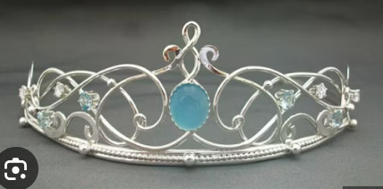

* contempory - of the present time; modern.
* deductive - Looking the evidence and make decision (Dog ripping the newspaper and make into shreds)
* band
    * Group of people (eg.Musicians)
    * Head Band
* Speckled - design , spot (eg.egg)
* commonplace - usual
* surry family - southern family
* veils - covered (wedding women dress)
* haggered - Tired / stressed
* intimate - close / trusted
* good sense to light the fire - very interest to do something
* agitation - stress
* weary - very tired
* spattered - something with small drops of something wet.
* Opal tiara
